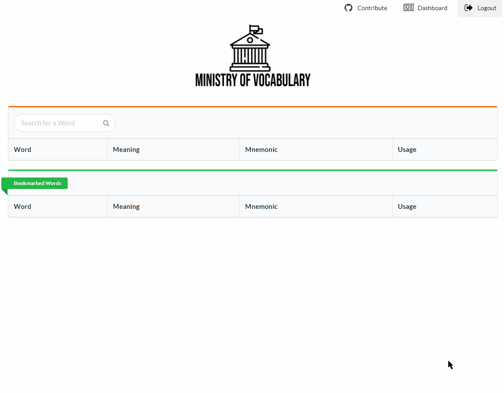

# [vocab.js.org](https://vocab.js.org)
codename Ministry Of Vocabulary

A MERN Stack app which helps you learn new words, improve your vocabulary and explore mnemonics. 

## Features
- [x] NoSQL Database with around 40,000 records of words with meaning, mnemonics, usage and more. Used MongoDB Atlas to host the same.
- [x] Simple CRUD operations
- [x] Node.js/Express.
- [x] React.js powered by Semantic UI.
- [x] Redux for State Management.
- [x] User Authentication with JWT.
- [x] Improved and Secure API calls. 
- [x] Deboucing API calls during typing, thus unnecessary backend calls are significatly reduced.
- [x] Production deployment(API + Front End) through `main` branch. CI/CD pipeline setup in Heroku.
- [x] Front End only deployment on `gh-release` branch through GitHub Actions to build and deploy on `gh-pages`.
- [ ] Adding more words, meaning and mneomonics.
- [ ] Improvment in UI 💅

### Demo


## Running locally

```
git clone git@github.com:lameguest21/ministry-of-vocabulary.git
cd ministry-of-vocabulary
npm i

cd client
npm i

cd ..
npm start
```

## Overview

`create-react-app` configures a Webpack development server to run on `localhost:3000`. This development server will bundle all static assets located under `client/src/`. All requests to `localhost:3000` will serve `client/index.html` which will include Webpack's `bundle.js`.

To prevent any issues with CORS, the user's browser will communicate exclusively with the Webpack development server.

Inside `Client.js`, we use Fetch to make a request to the API:

```js
// Inside Client.js
return fetch(`/api/word?q=${query}`, {
  // ...
})
```

This request is made to `localhost:3000`, the Webpack dev server. Webpack will infer that this request is actually intended for our API server. We specify in `package.json` that we would like Webpack to proxy API requests to `localhost:3001`:

```js
// Inside client/package.json
"proxy": "http://localhost:3001/",
```

This handy features is provided for us by `create-react-app`.

Therefore, the user's browser makes a request to Webpack at `localhost:3000` which then proxies the request to our API server at `localhost:3001`:


This setup provides two advantages:

1. If the user's browser tried to request `localhost:3001` directly, we'd run into issues with CORS.
2. The API URL in development matches that in production. You don't have to do something like this:

```js
// Example API base URL determination in Client.js
const apiBaseUrl = process.env.NODE_ENV === 'development' ? 'localhost:3001' : '/'
```

This setup uses [concurrently](https://github.com/kimmobrunfeldt/concurrently) for process management. Executing `npm start` instructs `concurrently` to boot both the Webpack dev server and the API server. The `react-scripts` are started in /client folder with the above command and `nodemon` starts the API server in dev mode thus enabling hot reloading with the exception of /client folder under watchlist which is ignored by nodemon.

## Credits

Thanks to Anthony Accomazzo . This project uses code from [food-lookup-demo](https://github.com/fullstackreact/food-lookup-demo.git).
